# DungeonGame
You are an adventurer searching for the Three Souls Scarab!

# What can you do in the game?
This is a text-based adventure game. It is also known as a command-line game or text adventure game.

For every situation, you make a choice, and that choice influences your storyline. The ultimate goal is to find the Three Souls Scarab. Once you have found it, you win the game.

# Getting Started
## Installation
1. Make sure you have an IDE installed, such as PyCharm or Visual Studio
2. Clone the repository via the terminal
3. Click **"RUN"** to play the game

## How do you play the game?
Unless you are asked to enter a word, you will always need to enter a number. Usually, you will have a choice between 2 or 3 options. You enter the number in the terminal to continue playing.  
When the game ends, the program stops, and you will need to click **"RUN"** again to restart the game.

# Project Information
This is a homework assignment from lesson 2 of the Programming Fundamentals learning track in the Web Development bootcamp at Hogeschool NOVI.

---
# Documentation
Learning track: Hogeschool NOVI Programming Fundamentals  
Lesson 2  

# What can you do in the game?
This is a text-based adventure game. It is also known as a command-line game or text adventure game.

For every situation, you make a choice, and that choice influences your storyline. The ultimate goal is to find the Three Souls Scarab. Once you have found it, you win the game.

## Flowchart: Structure of the Game
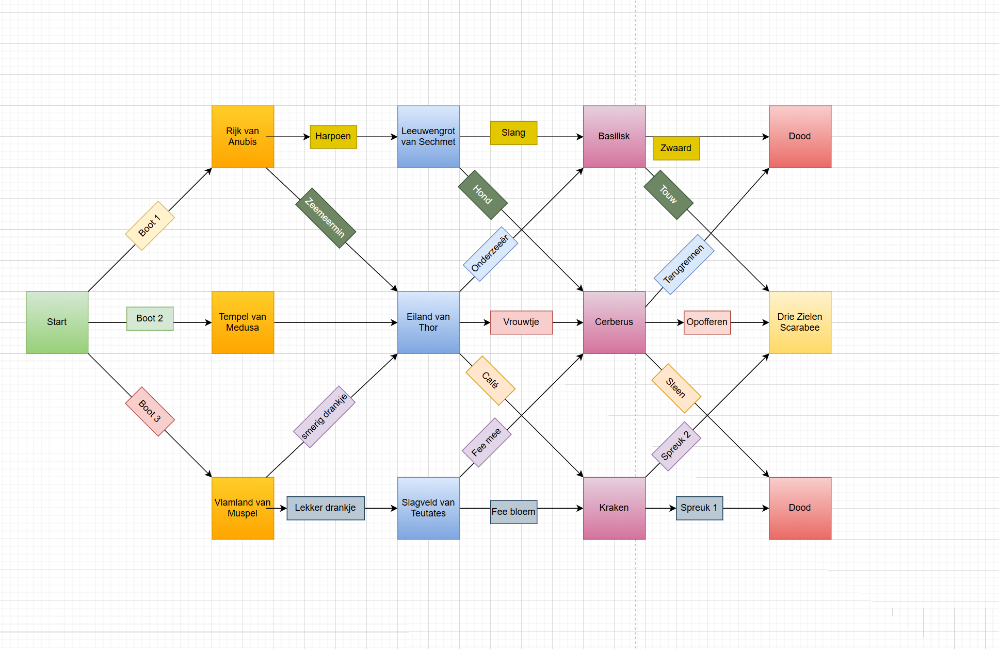</img>

## Printing a New Empty Line
This is the beginning of the game. You enter your name, and the game will use your name in the events that take place.  
I wanted to display the options underneath each other. But as you can see, that didn’t work at first. Of course, I knew this had to be possible.  
How I thought it should be written: `/n`

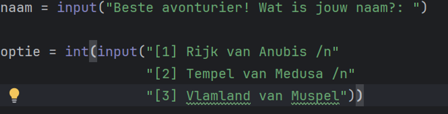</img>

**Output**

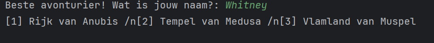</img>

## Where did it go wrong?
I was almost correct. It should be:

``` \n ``` 

Source: https://www.datacamp.com/tutorial/python-new-line  
And now it looks like this:

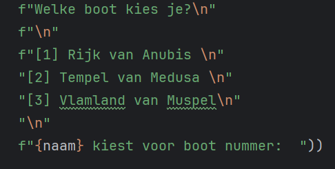</img>

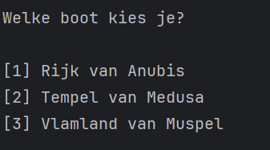</img>

## Displaying a Variable in Brackets as UPPERCASE
I wanted the variable `name` to be printed in uppercase. I didn’t know how to do that, so I looked it up. This is how it looked at first:

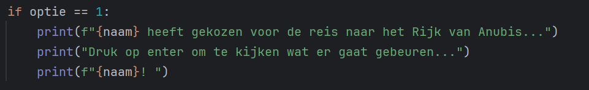</img>

Source: https://www.w3schools.com/python/ref_string_upper.asp  
Use `.upper()` to display the string in uppercase.

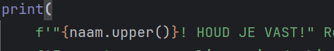</img>

## Repeating a Scene
Although the choices can often be different, some scenes need to be repeated. For example, I want choice 1 to lead to the basilisk scene.

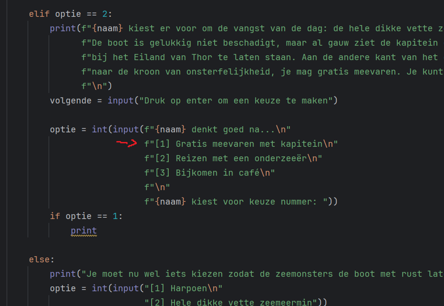</img>

**Basilisk scene**

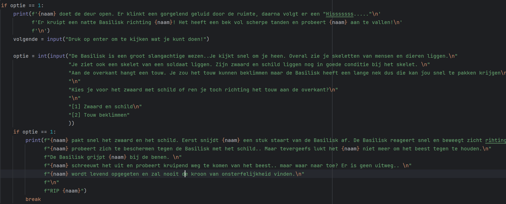</img>

Because I gave every input in the scene the same variable name (`option`), it was not clear which scene should be repeated.

Unfortunately, it became too confusing for me, so I restarted the project.  
This time I had trouble restarting the game when the player died. Sometimes the game returned to a previous input, but not all the way back to the beginning.

There was also a lot of repetition. I then checked which scenes appeared multiple times.

| Scene                   | Count |
|-------------------------|-------|
| Lion Cave of Sekhmet    | 1     |
| Battlefield of Teutates | 1     |
| Basilisk                | 2     |
| Kraken                  | 2     |
| Island of Thor          | 3     |
| Cerberus                | 3     |

This means I needed to write a function for each scene that is repeated. This way, I don’t have to rewrite pieces of code for every option that leads to the same scene.

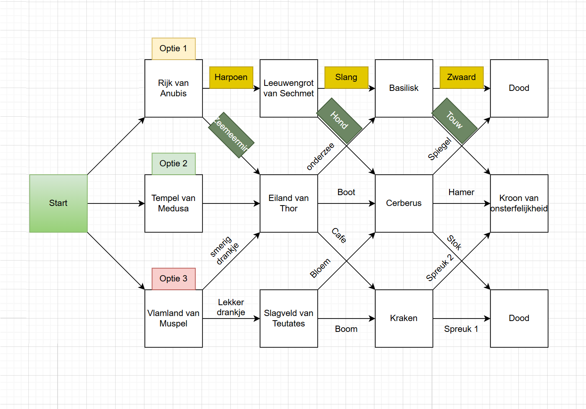</img>

## Structure
Later on, I also realized that my code lacked structure. Since I want to be able to play the game multiple times, the game itself also needed to be written as a function so it can be called again when the player dies or wins.

## Keep It Simple
I spent almost half a day working on the code. I stayed stuck in too much code for too long. I eventually managed to write the code, but not without frustration.

I seriously thought I needed to use a while loop for every choice. It looked something like this:

**Schematic**

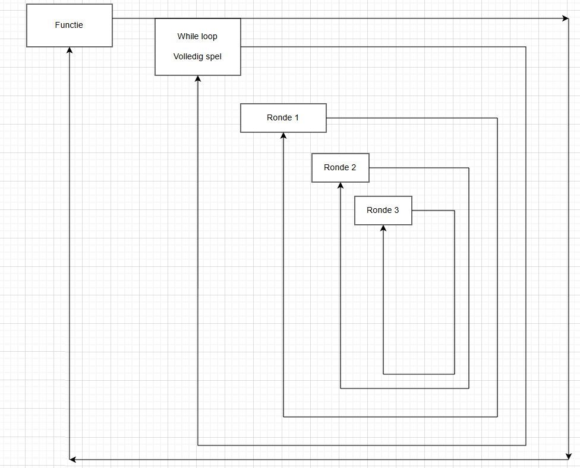</img>

## In Code
Here you can clearly see that I used multiple while loops in my code. It took some time because I changed my mind twice about whether all those while loops were necessary. Through trial and error, I learned that while loops are indeed necessary.

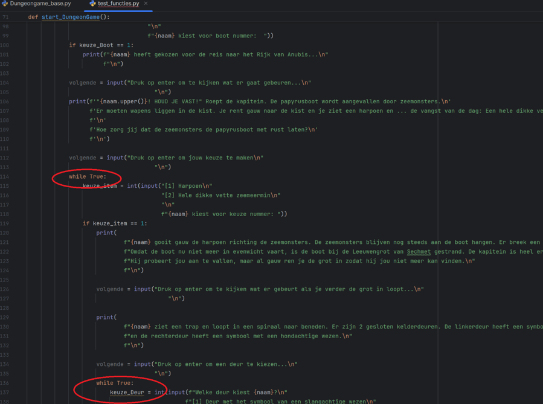</img>

## When Are While Loops Needed?
While loops are needed when you want code to repeat, but you don’t know how many times.  
For example, when an `int(input())` is required:

```python
int(input('Make a choice between 1, 2 and 3'))
```
You want the player to enter 1, 2, or 3. If the player enters 4, and you have neatly written an if, elif, and else statement, the else statement will only execute once and then the program stops.

However, you want the player to be able to try again. By placing the statements in a while loop, the input will be requested again until the correct input is entered. This is why `while True` is used.  
Every input is wrapped in a `while True`.

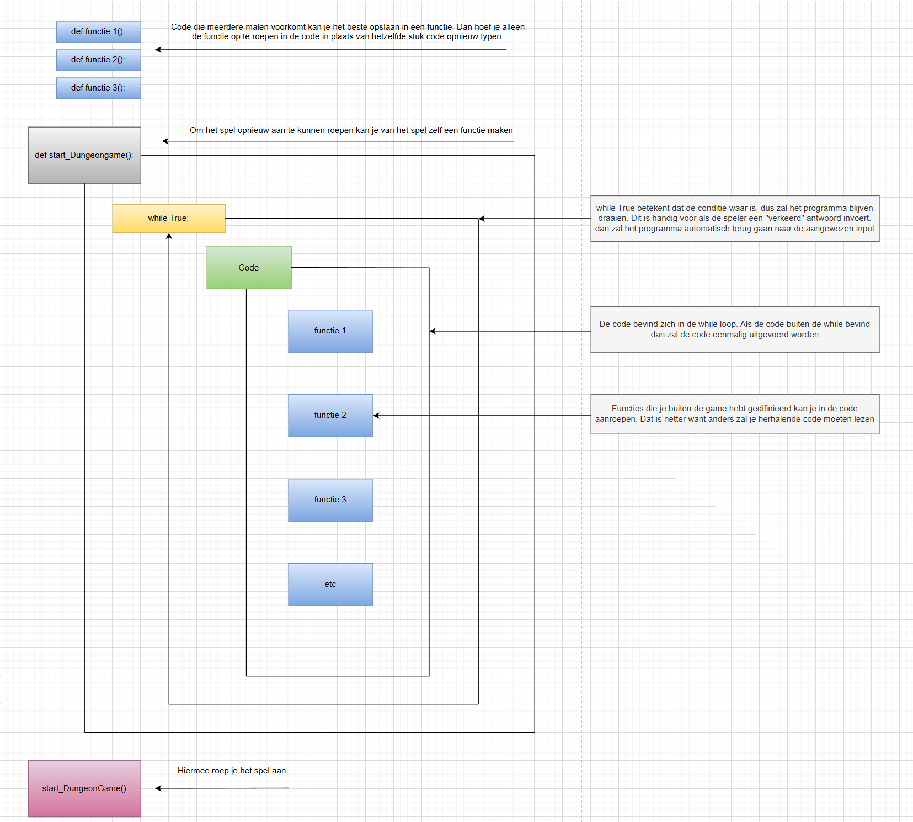</img>

## Try Except

Especially when inputs require a number, it is important that this actually happens. When Enter or a word is entered, a `ValueError` occurs and the program crashes.

This happens with the first input. Without try-except, Python correctly throws an error because it tries to convert a string to an integer. When you use try-except, the code returns to the input and asks again.  
I applied this to every input.

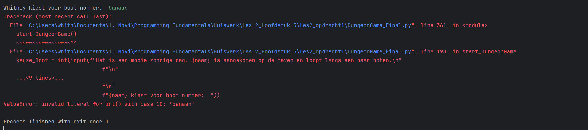</img>

Source: https://www.youtube.com/watch?v=j_q6NGOwDJo

## The Problem with the Island of Thor

I noticed that when I reached the end (regardless of whether the player won or lost), some routes caused the player to return to a previous choice menu. I tested almost all routes by drawing lines over my flowchart.

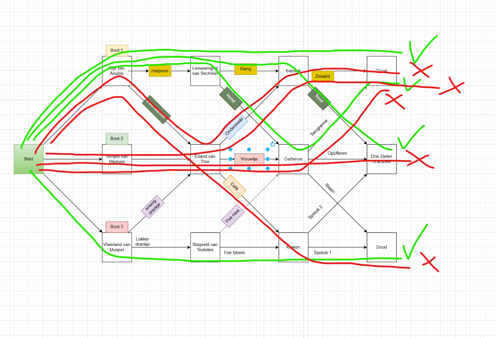</img>

## What Do You Notice?

Every time the route went through the Island of Thor, I ended up returning to the previous scene after the game ended (somewhere between the Island of Thor and the next scene).

So the problem originated in the Island of Thor scene.

## Taking a Step Back

Before explaining what went wrong in the Island of Thor scene, I first need to explain another function used in the code. Another recurring element is whether the player is “dead” or has found the “Three Souls Scarab”.

I check this with the following function:

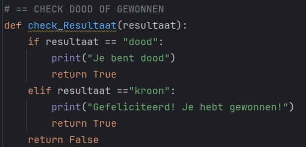</img>

This function checks whether the player is “dead” or has “won” after making a choice.  
(In the example, `crown` is used because that was the original idea of the game. I kept it in the code, but changed it to the Three Souls Scarab in the story.)

The function uses a return statement. If `check_Result(result)` returns `True`, the entire game stops. If it returns `False`, the function keeps running until it returns `True`.

This is a function of the Island of Thor scene: `def scene_Thor(name):`

When the player makes a choice in this scene, they are sent to another scene depending on that choice. These can be the Basilisk, Cerberus, or Kraken scenes. Because these scenes occur multiple times in the code, I created separate functions for each of them. They are listed under the comment:

``` # === SCENES === ```

Let’s take choice 1 as an example. This choice sends the player to the Basilisk scene. In the Basilisk scene (as well as in the Cerberus and Kraken scenes), the player makes the final decision that determines whether the player dies or wins.

Earlier, I showed that I created a function called `def check_Result(result):` to check whether the player has died or won, and to end the game when the result is `True`.

Because the Island of Thor scene contains a `while True`, after the player dies or wins in the final scene, the game returns to the still-running while loop.  
This happens because a while loop does not stop automatically—you have to stop it explicitly.

## How Do We Stop the Code?

That is why we created the function `def check_Result(result):`. We need to make sure that the result is returned to the choices made in the Island of Thor scene.

```result = scene_Basilisk(name)```

The Basilisk scene eventually ends with a return statement. This return value will always be `True`, because I explicitly defined that behavior in the `check_Result(result)` function.

```return result```

The return statement passes back whatever `scene_Basilisk(name)` returns. Since this value is `True`, it stops the choice menu in the Island of Thor scene.  
For this purpose, I created the variable `result`.

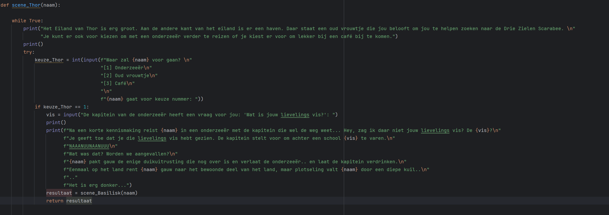</img>

## What Did I Learn from This Project?

1. Make the idea concrete by visualizing it in a flowchart  
2. Start with a small idea—you can always expand it later  
3. Don’t start coding immediately; first write everything out in pseudocode  
4. If something goes wrong, draw it out or make notes in your flowchart to better understand the problem  
5. Try to understand why you use certain statements. You should be able to explain in simple terms why you use specific code. If you can’t, you probably don’t fully understand what the code does. In that case, go back to the basics and practice simple code  
6. Do you notice that you have to repeat certain pieces of code often? Try to avoid this by creating functions. This saves you from copying and pasting and makes your code cleaner and more readable  
7. Don’t stay stuck for too long if you don’t know what to do. Start over, return to your pseudocode, do research, or ask someone who does know  
8. Start documenting immediately. If you document each problem at the moment it occurs, you actively work on solving it. When you read it back later, you will understand more quickly how you solved it  

## If I Had More Time, What Would I Change About the Project?

1. I would probably change the result value from `crown` to `won`  
2. After winning or losing, I would give the player the choice to restart the game or quit. Currently, the game always stops after the player wins or loses  
3. Spend more time on personalization during gameplay. For example, allowing user input (words) to influence how the player experiences the game. At the moment, I only ask for a favorite fish, which is not very creative yet  
4. I might implement a score counter. The game is quite short, but it could still be useful for testing purposes  
5. Or even better, implement a currency system where players can buy items with the money they earn during the game  
